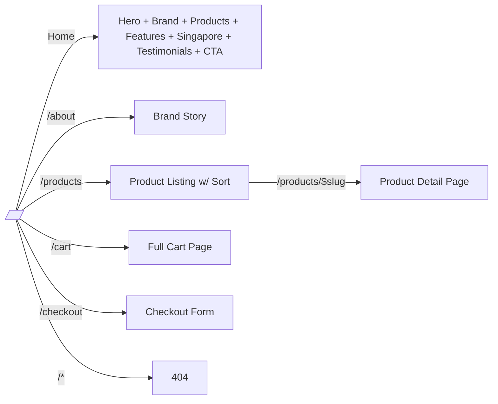

<h1 align="center">MĀMĀ — Wool Sneakers for the Modern City</h1>

<p align="center">
  <a href="https://github.com/wool-sneakers-mvp/wool-sneakers-mvp">
    
  </a>
  <a href="https://github.com/wool-sneakers-mvp/wool-sneakers-mvp/actions">
    
  </a>
  
  
  
  
  
  <a href="https://choosealicense.com/licenses/mit/">
    
  </a>
</p>

<p align="center"><b>🇸🇬 Singapore-born merino wool sneakers. <br/>Natural comfort meets urban function.</b></p>

---

## Overview

**MĀMĀ** is a production-grade e-commerce front-end for a Singapore-based wool sneaker brand. The application showcases six product SKUs through a quiet-luxury landing experience — warm whites, oat tones, and foggy-gray gradients inspired by the tactile quality of natural merino.

Built as a reference implementation following modern React and TypeScript standards, the stack demonstrates file-based routing, Zustand state management, Tailwind CSS-first theming with a custom wool-palette design system, and type-safe component boundaries crafted for tropical UX.

---

## Key Features

| Feature | Description |
|--------|-------------|
| 🛍️ Product Grid | Six SKU product catalog with gradient card backgrounds |
| 🗣️ Product Detail | Color swatches, size selectors with size guide modal, stock indicators |
| 🛒 Shopping Cart | Slide-in cart panel with quantity controls, persistent Zustand state |
| ✅ Runtime Validation | Zod schemas at all form boundaries (newsletter, checkout) |
| 📦 Checkout | Multi-step mock checkout with Zod schema validation |
| 🌴 Singapore Story | Dark-themed tropical climate data section with animated climate bars |
| 📱 Responsive | Mobile-first from 360 px with slide-in mobile navigation |
| ♿ Accessible | Skip links, focus traps, ARIA labels, `prefers-reduced-motion` |
| 🎨 Anti-Generic | Wolf-Gray bespoke palette, Cormorant Garamond + DM Sans + Space Grotesk typography |

---

## Architecture

| Layer | Technology | Version | Purpose |
|-------|-----------|---------|---------|
| Framework | React | ^19.2 | Concurrent rendering, `useActionState` |
| Language | TypeScript | ^6.0 | Strict mode, `erasableSyntaxOnly` |
| Build | Vite | ^8.0 | Rolldown engine, HMR, code splitting |
| Styling | Tailwind CSS | ^4.2 | CSS-first `@theme inline`, no config file |
| Routing | TanStack Router | ^1.169 | File-based, type-safe routing |
| State | Zustand | ^5.0 | Flat stores with `persist` middleware |
| Validation | Zod | ^4.4 | Runtime schema validation at boundaries |
| Testing | Vitest | ^4.1 | jsdom, behavioural tests |
| Icons | Lucide React | ^1.14.0 | Tree-shakeable SVG icons |
| Utilities | clsx + tailwind-merge | latest | Conditional class composition |

### Routing Map



### State Architecture

```mermaid
graph TD
    subgraph UI[useUIStore — ephemeral]
        U1[isCartOpen]
        U2[isMobileNavOpen]
        U3[toasts[]]
    end

    subgraph Cart[useCartStore — persist]
        C1[items[]]
        C2[addItem]
        C3[updateQty]
        C4[removeItem]
        C5[clearCart]
    end

    UI --> Shared((Shared Overlays))
    Cart --> Shared
```

---

## Quick Start

### Prerequisites

- **Node.js** ≥ 20 (LTS recommended)
- **npm** ≥ 10 (ships with Node ≥ 20)

### 1. Clone & Install

```bash
git clone <repo-url>
cd wool-sneakers-mvp
npm install --legacy-peer-deps
```

### 2. Generate Route Tree

```bash
npx tsr generate
```

### 3. Verify TypeScript + Tests

```bash
npx tsc --noEmit   # must yield zero errors
npx vitest run       # should report 17+ tests passing
```

### 4. Start Development Server

```bash
npm run dev
```

Open http://localhost:5173

### 5. Production Build

```bash
npm run build
```

Build artifacts are emitted to `dist/`.

---

## File Hierarchy

```
src/
├── main.tsx                          # Entry point (StrictMode + RouterProvider)
├── globals.css                       # Tailwind v4 @theme inline (wool palette)
├── globals.d.ts                      # CSS module declarations
├── routeTree.gen.ts                  # Auto-generated by TanStack Router
│
├── components/
│   ├── ui/                            # Primitive components (button, input, badge)
│   ├── shared/                        # Cross-cutting (SkipLink, Toast, GrainOverlay…)
│   ├── layout/                        # Structural (Navbar, Footer, AnnouncementBar)
│   ├── sections/                      # Home page sections
│   └── cart/                          # CartSlidePanel (slide-in overlay)
│
├── hooks/
│   ├── useThrottledScroll.ts         # rAF + throttled scroll handler
│   ├── useFocusTrap.ts               # Keyboard focus trap for overlays
│   └── useScrollReveal.ts            # IntersectionObserver wrapper
│
├── services/
│   └── products.ts                   # ProductService typed interface + impl
│
├── lib/
│   ├── utils.ts                      # cn() — clsx + tailwind-merge
│   ├── format.ts                     # formatPrice(cents) → SGD string
│   ├── schemas.ts                    # Zod validation schemas
│   └── products.ts                   # Product catalog + sort + lookup
│
├── routes/
│   ├── __root.tsx                     # Root layout (Navbar + Footer + Overlays)
│   ├── index.tsx                      # Home page
│   ├── about.tsx                      # Brand story
│   ├── products.index.tsx             # Product listing
│   ├── products.$slug.tsx            # Product detail
│   ├── cart.tsx                       # Full cart page
│   ├── checkout.tsx                   # Checkout form (Zod-validated)
│   └── $.tsx                          # 404 catch-all
│
├── stores/
│   ├── cart.ts                        # useCartStore (Zustand + persist)
│   └── ui.ts                          # useUIStore (Zustand, ephemeral)
│
├── types/
│   ├── product.ts                     # Product, ProductColor, etc.
│   ├── cart.ts                        # CartItem
│   └── ui.ts                          # Toast, ToastType
│
└── test/
    ├── setup.ts                       # jsdom, rAF + IntersectionObserver mocks
    ├── cart.store.test.ts             # 9 cart-store behaviour tests
    ├── ui.store.test.ts             # 4 UI-store behaviour tests
    └── utils.test.ts                # cn / formatPrice tests
```

---

## Validation & Schemas

Validation happens **only at system boundaries** — form submission, API input. Internal code trusts typed contracts.

| Schema | Validates | Usage |
|--------|-----------|-------|
| `newsletterSchema` | Email | NewsletterSection form |
| `checkoutSchema` | fullName, email, address, city, postalCode | Checkout form |

**Error extraction pattern:**
```typescript
const result = newsletterSchema.safeParse({ email: formData.email })
if (!result.success) {
  return { message: result.error.issues[0].message, type: 'error' }
}
```

---

## Repurposing for Other Projects

- Copy `src/globals.css` → `@theme` block, change token names, adjust hex values.
- Replace `src/lib/products.ts` → your own catalog.
- Update `src/stores/cart.ts` → your own cart logic.
- Adjust `src/components/ui/` primitives for your brand's look and feel.
- Swap or extend `src/routes/` → your own pages.

## Singleton Tailwind Palette Snippet (`src/globals.css`)

```css
@import "tailwindcss";

@theme inline {
  --color-primary: #3D3835;
  --color-surface: #F7F4F0;
  ...
  --font-display: 'Cormorant Garamond', serif;
}
```

## Tailwind v4 `@theme inline` Gotchas

- `@theme inline` is a **single CSS nestable block**; nested `@keyframes` must be inside it.
- Custom colours need `--color-` prefix to generate `text-`, `bg-`, `border-` utilities.
- Spacing tokens use `--spacing-*` (e.g. `--spacing-1: 8px`) for generated `m-1`, `p-1`, etc.

## Testing

Run the full suite (unit tests):

```bash
npx vitest run
```

Run in watch mode during development:

```bash
npm test
```

### Test Structure

| Test File | Concern | Count |
|-----------|---------|-------|
| `cart.store.test.ts` | Add, increment, separate color lines, remove, subtotal, count, empty, updateQty, clear | 9 |
| `ui.store.test.ts` | Cart toggle, mobile nav toggle, mutual exclusion (cart ↔ nav), toast CRUD | 4 |
| `utils.test.ts` | `cn()` tailwind-merge, `formatPrice()` locale formatting | 4 |

All tests pass within `~1.5 s` on a clean run.

---

## Design System

### Wool Color Palette

| Token | Value | Usage |
|-------|-------|-------|
| `warm-white` | `#F7F4F0` | Page background |
| `cream` | `#FDFBF8` | Card backgrounds |
| `oat-50` – `oat-500` | `#F5F0E8` – `#B5A288` | Surfaces, borders, hover states |
| `fog-50` – `fog-400` | `#E8E5E0` – `#8C8580` | Text, mid-tones, muted borders |
| `wool-900` | `#3D3835` | Primary text, dark backgrounds |
| `wool-300` | `#8C8580` | Secondary/tertiary text |

### Typography

| Role | Font | Usage |
|------|------|-------|
| Display | Cormorant Garamond | Headings, brand voice |
| Body | DM Sans | Paragraphs, form labels |
| Accent | Space Grotesk | Eyebrows / labels, uppercase |

---

## Lessons Learned

### 1. Component Interface Naming

Always use descriptive prop names. `ErrorBoundary` was changed from generic `Props`/`State` to `ErrorBoundaryProps`/`ErrorBoundaryState` for clarity.

### 2. Zod v4 Error Access

Zod v4 uses `error.issues[0].message`, **not** `error.errors[0].message`.

### 3. Service Layer Abstraction

Extracting a typed `ProductService` makes swapping implementations (in-memory → API) zero-friction for consumers.

### 4. Barrel Exports

Centralizing exports in `src/components/index.ts`, `src/hooks/index.ts`, and `src/lib/index.ts` keeps imports consistent and prevents deep-path coupling.

---

## Troubleshooting

| Symptom | Cause | Fix |
|---------|-------|-----|
| `TS2304: Cannot find name 'Props'` | Generic interface name reused | Rename to `ErrorBoundaryProps` |
| `TS2339: Property 'errors' does not exist on 'ZodError'` | Zod v4 API changed | Use `error.issues` instead of `error.errors` |
| `routeTree.gen.ts` missing | Forgetting `npx tsr generate` | Always regenerate after route changes |
| `bg-gradient-to-*` fails in v4 | Tailwind v3 → v4 breaking change | Use `bg-linear-to-*` |
| `outline-none` not found in v4 | Tailwind v3 → v4 breaking change | Use `outline-hidden` |
| `flex-shrink-0` not found in v4 | Tailwind v3 → v4 breaking change | Use `shrink-0` |
| Raw hex in `className` not caught at build | `@theme` token exists but unused | Use `text-wool-900` instead of `text-[#3D3835]` |
| `container-custom` undefined at runtime | Missing or typo in `@layer utilities` | Check `globals.css` `@layer utilities` |
| `.env` missing | `.env.example` not copied | Run `cp .env.example .env` |

---

## Performance Budgets (v4)

- **JS bundle** ≤ 100 KB gzipped (`index-[hash].js`)
- **CSS** ≤ 15 KB gzipped (`index-[hash].css`)
- **Fonts** Subset `woff2` with `font-display: swap`
- **Images** Use `loading="lazy"` + `decoding="async"` for below-the-fold
- **Vite chunking** `manualChunks` for `react`, `tanstack`, `lucide` vendors

## Deployment

1. `npx tsc --noEmit`
2. `npx vitest run`
3. `npm run build`
4. Verify output in `dist/`
5. Upload `dist/` to Vercel / Netlify / Cloudflare Pages

## Security Checklist

- [ ] No secrets in `index.html` or client bundle
- [ ] CSP meta tag present
- [ ] `rel="noopener noreferrer"` on external links
- [ ] `X-Frame-Options: DENY` via server headers (not just meta)

---

## Contributing

1. **TDD Cycle** — write a failing test first, make it pass, then refactor.
2. **Branch from `main`** — short-lived branches (merge within 1–3 days).
3. **Pre-commit checks** — TypeScript strict, then Vitest, then build.
4. **Quality gates** — `npx tsc --noEmit`, `npx vitest run`, `npm run build` must all pass.

---

## Project Status

| Phase | Status | Deliverable |
|-------|--------|-------------|
| Foundation | ✅ Complete | Vite 8 + Tailwind v4 + TypeScript strict + Vitest |
| State Management | ✅ Complete | Zustand cart + UI stores |
| Routing | ✅ Complete | TanStack Router, 7 routes |
| Home Page | ✅ Complete | 7 sections + hero + footer |
| Product Pages | ✅ Complete | Grid, detail, size guide, add-to-cart |
| Cart | ✅ Complete | Slide-in panel + full page |
| Checkout | ✅ Complete | Mock multi-step checkout with Zod validation |
| Testing | ✅ Complete | 17+ tests, all green |
| Polish | ✅ Complete | Grain overlay, scroll animations, responsive |

---

## License

[MIT](LICENSE)
